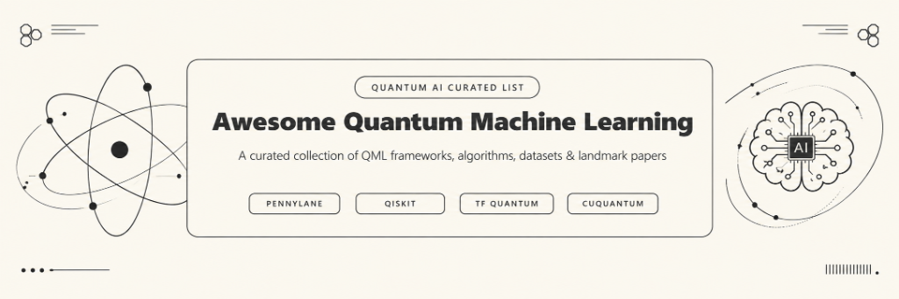

# Awesome Quantum Machine Learning 

> A curated list of awesome Quantum Machine Learning (QML) frameworks, libraries, landmark research papers, courses, books, tools, and platforms.

Quantum Machine Learning merges quantum computing with classical machine learning techniques to process data and solve complex computational problems faster.

---

## Contents

- [Frameworks & Libraries](#frameworks--libraries)
- [Books](#books)
- [Courses & Tutorials](#courses--tutorials)
- [Articles & Research Papers](#articles--research-papers)
- [Tools & Simulators](#tools--simulators)
- [Platforms & Cloud Providers](#platforms--cloud-providers)
- [Datasets](#datasets)
- [Community & Events](#community--events)
- [Contributing](#contributing)
- [License](#license)

---

## Frameworks & Libraries

- [Paddle Quantum](https://github.com/PaddlePaddle/Quantum) - Quantum machine learning toolkit developed on PaddlePaddle.
- [PennyLane](https://pennylane.ai/) - Cross-platform Python library for quantum machine learning, automatic differentiation, and optimization of quantum circuits.
- [Qiskit Machine Learning](https://qiskit-community.github.io/qiskit-machine-learning/) - Quantum machine learning algorithms and computational primitives built on top of Qiskit.
- [TensorFlow Quantum (TFQ)](https://github.com/tensorflow/quantum) - Quantum machine learning library for rapid prototyping of hybrid quantum-classical ML models.
- [TorchQuantum](https://github.com/mit-han-lab/torchquantum) - PyTorch-centric framework for Quantum Machine Learning and Quantum Neural Networks.
- [Yao.jl](https://github.com/QuantumBFS/Yao.jl) - Extensible, efficient framework for Quantum Algorithm Design in Julia.

## Books

- [Hands-On Quantum Machine Learning with Python](https://arxiv.org/abs/2102.05158) - *Dr. Frank Zickert* - Practical guide using Python to build quantum neural networks and algorithms.
- [Machine Learning with Quantum Computers](https://link.springer.com/book/10.1007/978-3-030-83098-4) - *Maria Schuld & Francesco Petruccione* (2nd Edition) - Updated deep dive into quantum algorithms, kernel methods, and variational circuits.
- [Quantum Machine Learning: What Quantum Computing Means to Data Mining](https://www.sciencedirect.com/book/9780128100400/quantum-machine-learning) - *Peter Wittek* - Early comprehensive textbook introducing QML fundamentals.
- [Supervised Learning with Quantum Computers](https://link.springer.com/book/10.1007/978-3-319-96424-9) - *Maria Schuld & Francesco Petruccione* - Comprehensive technical analysis on supervised methods in quantum systems.

## Courses & Tutorials

- [EDX - Quantum Machine Learning](https://www.edx.org/) - Online academic program covering theoretical and practical concepts of QML.
- [MIT Professional Education - Quantum Machine Learning](https://professional.mit.edu/) - Applied course focusing on industrial and commercial applications of QML.
- [Qiskit Machine Learning Course](https://learn.qiskit.org/course/machine-learning) - Official hands-on tutorial series covering QML basics, quantum kernels, and neural networks.
- [Xanadu Codebook](https://codebook.xanadu.ai/) - Interactive hands-on training module for quantum computing and quantum machine learning.

## Articles & Research Papers

- [Barren plateaus in quantum neural network training landscapes](https://www.nature.com/articles/s41467-018-07090-4) - Foundational paper analyzing gradient disappearance in quantum neural networks.
- [Quantum Machine Learning (Nature 2017)](https://www.nature.com/articles/nature23474) - Landmark survey paper exploring quantum algorithms applied to big data and machine learning.
- [Quantum Machine Learning in the NISQ era and beyond](https://arxiv.org/abs/2102.05162) - Detailed discussion on current noisy quantum hardware applications.
- [The theory of variational quantum algorithms (Nature 2021)](https://arxiv.org/abs/2012.09265) - Comprehensive overview of VQAs, the backbone of modern QML.

## Tools & Simulators

- [Cirq](https://quantumai.google/cirq) - Google's Python software library for writing, manipulating, and optimizing quantum circuits.
- [Qibo](https://github.com/qiboteam/qibo) - Open-source API for quantum simulation and hardware control with GPU acceleration support.
- [Qiskit Aer](https://github.com/Qiskit/qiskit-aer) - High-performance quantum circuit simulator framework for Qiskit.
- [QuTiP](https://qutip.org/) - Quantum Toolbox in Python for simulating dynamics of open quantum systems.

## Platforms & Cloud Providers

- [Amazon Braket](https://aws.amazon.com/braket/) - Fully managed quantum computing service from AWS to explore and build quantum algorithms.
- [IBM Quantum Platform](https://quantum.ibm.com/) - Cloud access to real superconducting quantum processors and simulators.
- [Microsoft Azure Quantum](https://azure.microsoft.com/en-us/products/quantum) - Cloud ecosystem giving access to diverse quantum hardware providers (IonQ, Rigetti, Quantinuum).
- [Xanadu Cloud](https://cloud.xanadu.ai/) - Access to photonic quantum computers optimized for PennyLane integration.

## Datasets

- [PennyLane Datasets](https://pennylane.ai/datasets) - Pre-calculated quantum datasets including spin systems, molecular geometries, and quantum circuits.
- [Quantum Chemistry Literature Data (QMCData)](https://github.com/quantum-machine-learning) - Public quantum chemistry benchmark datasets formatted for QML training.

## Community & Events

- [PennyLane Discussion Forum](https://discuss.pennylane.ai/) - Community hub for QML researchers, engineers, and open-source contributors.
- [Qiskit Slack Community](https://qiskit.slack.com/) - Active chat platform for quantum software developers and QML enthusiasts.
- [Quantum Computing Stack Exchange](https://quantumcomputing.stackexchange.com/) - Question and answer site for researchers and practitioners.

---

## Contributing

Contributions are welcome! Please read the [Contributing Guidelines](CONTRIBUTING.md) before submitting a pull request.

## License

To the extent possible under law, the author has waived all copyright and related or neighboring rights to this work.
