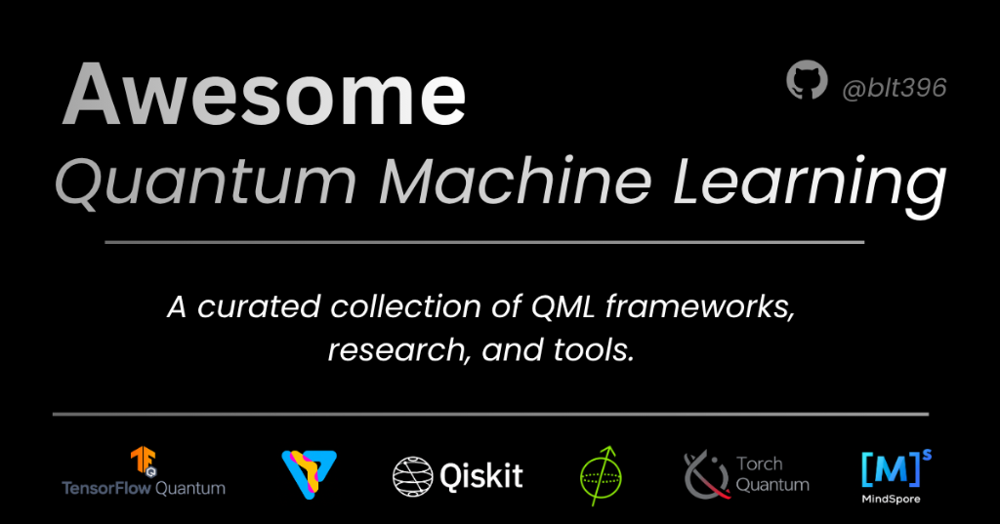

  

# Awesome Quantum Machine Learning 

> A curated collection of QML frameworks, research, and tools.

Quantum Machine Learning merges quantum computing with classical machine learning techniques to process data and solve complex computational problems faster.

> 🚀 **Getting Started with Quantum Machine Learning:**
> - **New to QML?** Start with interactive, hands-on modules like [Xanadu Codebook](#tutorials) or the [Qiskit Machine Learning Course](#tutorials).
> - **Foundational Theory:** Explore our curated list of academic [Courses](#courses) and theoretical [Books](#books).
> - **Hands-On Development:** Jump straight into industry-standard [Frameworks](#frameworks) and [Libraries](#libraries).

---

## Contents

- [Frameworks](#frameworks)
- [Libraries](#libraries)
- [Books](#books)
- [Courses](#courses)
- [Tutorials](#tutorials)
- [Articles](#articles)
- [Research Papers](#research-papers)
- [Tools](#tools)
- [Simulators](#simulators)
- [Platforms](#platforms)
- [Cloud Providers](#cloud-providers)
- [Datasets](#datasets)
- [Videos](#videos)
- [Channels](#channels)
- [Podcasts](#podcasts)
- [Communities](#communities)
- [Events](#events)
- [Contributing](#contributing)
- [License](#license)

---

## Frameworks

- [CUDA-Q](https://github.com/NVIDIA/cuda-quantum) - Open-source platform by NVIDIA for integrating and programming quantum processing units with GPUs and CPUs.
- [MindQuantum](https://github.com/mindspore-ai/mindquantum) - General-purpose quantum computing and quantum machine learning framework based on MindSpore.
- [Qiskit Machine Learning](https://qiskit-community.github.io/qiskit-machine-learning/) - Quantum machine learning algorithms and computational primitives built on top of Qiskit.
- [TensorCircuit-NG](https://github.com/tensorcircuit/tensorcircuit-ng) - High-performance quantum software framework natively integrated with JAX, PyTorch, and TensorFlow for variational algorithms.
- [TorchQuantum](https://github.com/mit-han-lab/torchquantum) - PyTorch-centric framework for Quantum Machine Learning and Quantum Neural Networks.
- [Yao.jl](https://github.com/QuantumBFS/Yao.jl) - Extensible, efficient framework for Quantum Algorithm Design in Julia.

## Libraries

- [Paddle Quantum](https://github.com/PaddlePaddle/Quantum) - Quantum machine learning toolkit developed on PaddlePaddle.
- [PennyLane](https://pennylane.ai/) - Cross-platform Python library for quantum machine learning, automatic differentiation, and optimization of quantum circuits.
- [sQUlearn](https://github.com/squlearn/squlearn) - Scikit-learn-compatible Python library for quantum machine learning on gate-based quantum computers.
- [Strawberry Fields](https://github.com/XanaduAI/strawberryfields) - Full-stack Python library for designing, simulating, and optimizing continuous-variable quantum architectures.
- [TensorFlow Quantum (TFQ)](https://github.com/tensorflow/quantum) - Quantum machine learning library for rapid prototyping of hybrid quantum-classical ML models.
- [Tequila](https://github.com/tequilahub/tequila) - Extensible development package for rapid prototyping of variational quantum algorithms and quantum machine learning models.

## Books

- [Hands-On Quantum Machine Learning with Python](https://arxiv.org/abs/2102.05158) - *Dr. Frank Zickert* - Practical guide using Python to build quantum neural networks and algorithms.
- [Machine Learning with Quantum Computers](https://link.springer.com/book/10.1007/978-3-030-83098-4) - *Maria Schuld & Francesco Petruccione* (2nd Edition) - Updated deep dive into quantum algorithms, kernel methods, and variational circuits.
- [Quantum Computing: An Applied Approach](https://link.springer.com/book/10.1007/978-3-030-83274-2) - *Jack D. Hidary* - Applied introduction bridging quantum computing fundamentals, algorithms, and machine learning implementations.
- [Quantum Machine Learning with Python](https://link.springer.com/book/10.1007/978-1-4842-7098-1) - *Santanu Pattanayak* - Practical introduction to quantum theory, variational algorithms, and quantum neural networks with Python.
- [Quantum Machine Learning: What Quantum Computing Means to Data Mining](https://www.sciencedirect.com/book/9780128100400/quantum-machine-learning) - *Peter Wittek* - Early comprehensive textbook introducing QML fundamentals.
- [Supervised Learning with Quantum Computers](https://link.springer.com/book/10.1007/978-3-319-96424-9) - *Maria Schuld & Francesco Petruccione* - Comprehensive technical analysis on supervised methods in quantum systems.

## Courses

- [Coursera - Introduction to Quantum Information](https://www.coursera.org/learn/introduction-to-quantum-information) - Foundational academic course on quantum states, operations, and information processing principles.
- [Coursera - Quantum Computing For Everyone](https://www.coursera.org/learn/quantum-computing-for-everyone-an-introduction) - Accessible introduction to quantum mechanics concepts, quantum circuits, and algorithmic building blocks.
- [EDX - Quantum Machine Learning](https://www.edx.org/) - Online academic program covering theoretical and practical concepts of QML.
- [MIT Professional Education - Quantum Machine Learning](https://professional.mit.edu/) - Applied course focusing on industrial and commercial applications of QML.
- [Stanford Online - Quantum Mechanics for Scientists and Engineers](https://online.stanford.edu/courses/soe-yqe0001-quantum-mechanics-scientists-and-engineers) - In-depth graduate-level course providing mathematical foundations for quantum technologies.

## Tutorials

- [PennyLane QML Demos](https://pennylane.ai/qml/demos/) - Extensive collection of curated, community-driven demonstrations and tutorials on quantum machine learning algorithms.
- [Qiskit Machine Learning Course](https://learn.qiskit.org/course/machine-learning) - Official hands-on tutorial series covering QML basics, quantum kernels, and neural networks.
- [Xanadu Codebook](https://codebook.xanadu.ai/) - Interactive hands-on training module for quantum computing and quantum machine learning.

## Articles

- [Classification with Quantum Neural Networks on Near Term Processors (2018)](https://arxiv.org/abs/1802.06002) - Edward Farhi and Hartmut Neven's pioneering work proposing quantum neural network architectures for classification.
- [Quantum Machine Learning in the NISQ era and beyond](https://arxiv.org/abs/2102.05162) - Detailed discussion on current noisy quantum hardware applications.

## Research Papers

- [Barren plateaus in quantum neural network training landscapes](https://www.nature.com/articles/s41467-018-07090-4) - Foundational paper analyzing gradient disappearance in quantum neural networks.
- [Power of data in quantum machine learning (Nat. Commun. 2021)](https://arxiv.org/abs/2011.01938) - Hsin-Yuan Huang et al.'s rigorous study examining the advantages and computational boundaries of quantum machine learning.
- [Quantum generative adversarial networks (PRA 2018)](https://arxiv.org/abs/1804.08641) - Pierre-Luc Dallaire-Demers and Nathan Killoran's framework introducing QGANs for continuous-variable and discrete systems.
- [Quantum Generative Adversarial Networks (PRL 2018)](https://arxiv.org/abs/1804.09139) - Seth Lloyd and Christian Weedbrook's seminal paper demonstrating exponential quantum advantage in generator-discriminator games.
- [Quantum Machine Learning (Nature 2017)](https://www.nature.com/articles/nature23474) - Landmark survey paper exploring quantum algorithms applied to big data and machine learning.
- [Quantum Machine Learning in Feature Hilbert Spaces (PRL 2019)](https://arxiv.org/abs/1803.07128) - Maria Schuld and Nathan Killoran's landmark paper connecting quantum circuits to kernel methods in reproducing kernel Hilbert spaces.
- [Quantum principal component analysis (Nature Physics 2014)](https://arxiv.org/abs/1307.0401) - Seth Lloyd, Masoud Mohseni, and Patrick Rebentrost's milestone algorithm providing exponential speedup for PCA.
- [Quantum Support Vector Machine for Big Data Classification (PRL 2014)](https://arxiv.org/abs/1307.0471) - Patrick Rebentrost, Masoud Mohseni, and Seth Lloyd's foundational paper introducing the quantum SVM algorithm.
- [Supervised learning with quantum-enhanced feature spaces (Nature 2019)](https://arxiv.org/abs/1804.11326) - Vojtěch Havlíček et al.'s milestone paper implementing quantum kernels on superconducting quantum hardware.
- [The power of quantum neural networks (Nat. Comput. Sci. 2021)](https://arxiv.org/abs/2011.00027) - Amira Abbas et al.'s analysis demonstrating the superior capacity and effective dimension of quantum neural networks.
- [The theory of variational quantum algorithms (Nature 2021)](https://arxiv.org/abs/2012.09265) - Comprehensive overview of VQAs, the backbone of modern QML.

## Tools

- [Cirq](https://quantumai.google/cirq) - Google's Python software library for writing, manipulating, and optimizing quantum circuits.
- [cuQuantum](https://github.com/NVIDIA/cuQuantum) - NVIDIA SDK of optimized libraries and high-performance primitives for accelerating quantum computing workflows on GPUs.
- [QuTiP](https://qutip.org/) - Quantum Toolbox in Python for simulating dynamics of open quantum systems.

## Simulators

- [PennyLane Lightning](https://github.com/PennyLaneAI/pennylane-lightning) - High-performance C++ and GPU state-vector simulator plugins for accelerated PennyLane workflows.
- [Qibo](https://github.com/qiboteam/qibo) - Open-source API for quantum simulation and hardware control with GPU acceleration support.
- [Qiskit Aer](https://github.com/Qiskit/qiskit-aer) - High-performance quantum circuit simulator framework for Qiskit.
- [Qulacs](https://github.com/qulacs/qulacs) - Ultra-fast C/C++ quantum circuit simulator with Python bindings designed for large, noisy quantum circuits.

## Platforms

- [IBM Quantum Platform](https://quantum.ibm.com/) - Cloud access to real superconducting quantum processors and simulators.
- [Quantinuum](https://www.quantinuum.com/) - Integrated quantum computing platform combining trapped-ion hardware and software solutions.
- [Xanadu Cloud](https://cloud.xanadu.ai/) - Access to photonic quantum computers optimized for PennyLane integration.

## Cloud Providers

- [Amazon Braket](https://aws.amazon.com/braket/) - Fully managed quantum computing service from AWS to explore and build quantum algorithms.
- [Microsoft Azure Quantum](https://azure.microsoft.com/en-us/solutions/quantum-computing/) - Cloud ecosystem giving access to diverse quantum hardware providers (IonQ, Rigetti, Quantinuum).
- [Rigetti Quantum Cloud Services (QCS)](https://qcs.rigetti.com/) - Cloud platform providing low-latency hybrid classical-quantum computing infrastructure.

## Datasets

- [PennyLane Datasets](https://pennylane.ai/datasets) - Pre-calculated quantum datasets including spin systems, molecular geometries, and quantum circuits.
- [Quantum Chemistry Literature Data (QMCData)](https://github.com/quantum-machine-learning) - Public quantum chemistry benchmark datasets formatted for QML training.

## Videos

- [Qiskit Global Summer School - QML Playlist](https://www.youtube.com/playlist?list=PLOFEBzvs-VvqJwybFxkWi5grWb24U7liE) - Comprehensive lecture video series and lab walkthroughs dedicated to quantum machine learning.

## Channels

- [Qiskit YouTube Channel](https://www.youtube.com/@qiskit) - Official IBM Quantum YouTube channel featuring tutorials, seminar series, and quantum coding challenges.
- [Xanadu YouTube Channel](https://www.youtube.com/@XanaduAI) - Video guides, research talks, and community coding sessions centered on PennyLane and photonic quantum computing.

## Podcasts

- [Quantum Computing Now Podcast](https://quantumcomputingnow.com/) - Weekly podcast exploring current breakthroughs, quantum concepts, and interviews in quantum computing.
- [Quantum Tech Pod](https://www.insidequantumtechnology.com/) - Deep-dive discussions and interviews on the commercialization and technical progress of quantum technologies.

## Communities

- [PennyLane Discussion Forum](https://discuss.pennylane.ai/) - Community hub for QML researchers, engineers, and open-source contributors.
- [Qiskit Slack Community](https://qiskit.slack.com/) - Active chat platform for quantum software developers and QML enthusiasts.
- [Quantum Computing Stack Exchange](https://quantumcomputing.stackexchange.com/) - Question and answer site for researchers and practitioners.
- [QWorld Community](https://qworld.net/) - Non-profit global network connecting quantum computing enthusiasts, researchers, and students.

## Events

- [QWorld Workshops](https://qworld.net/workshops/) - Global non-profit educational workshops and open training materials on quantum computing and quantum algorithms.

---

## Contributing

Contributions are welcome! Please read the [Contributing Guidelines](CONTRIBUTING.md) before submitting a pull request.

## License

To the extent possible under law, the author has waived all copyright and related or neighboring rights to this work.
